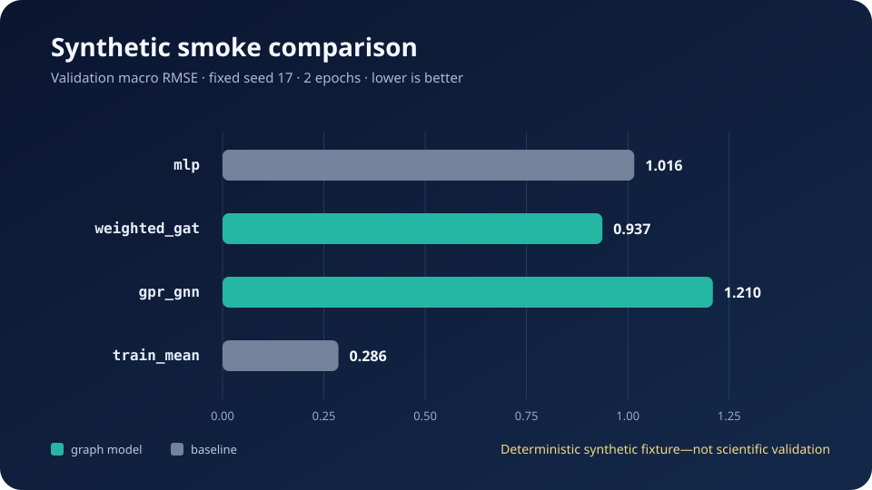
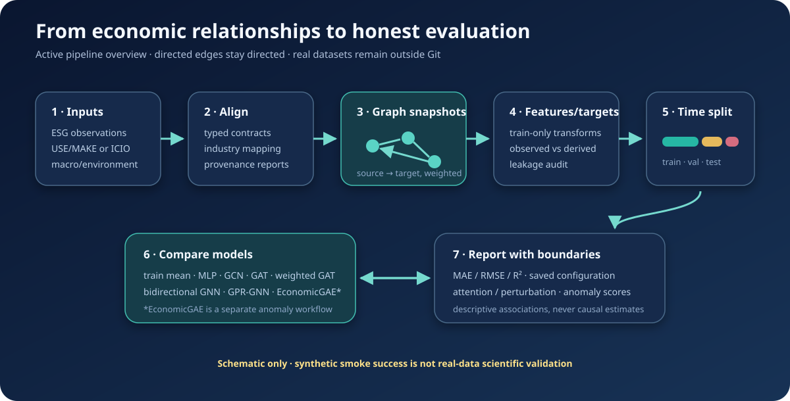

# ESG Analysis with Graph Neural Networks

A research-oriented machine learning project that studies whether graph neural networks can improve ESG-related prediction by modelling directed economic relationships between industries or entities.

The active code represents **nodes** as aligned industries/entities, **edges** as directed and optionally weighted economic relationships (for example, input-output flows), and **targets** as named observed ESG/economic outcomes or explicitly opted-in derived research indices. It compares non-graph baselines with direction-preserving GCN, GAT, weighted GAT, bidirectional GNN, and GPR-GNN models. The only committed comparable metrics are a deterministic synthetic smoke benchmark: the train-mean baseline has the lowest validation RMSE (0.286), while the three short-trained neural examples range from 0.937 to 1.210. That is workflow evidence—not evidence that any model improves real ESG prediction.

> **Limitation warning:** no licensed research dataset or independently reproduced real-data result is committed. Synthetic smoke success is not scientific validation; graph relationships are not causal proof; attention, perturbation, and anomaly scores are descriptive model outputs, not causal estimates.

Run the main smoke test after installing dependencies:

```bash
python scripts/run_experiment_smoke.py
```

## Project at a glance

| Question | Active project answer |
|---|---|
| Problem | Test whether directed economic graphs add useful signal for ESG-related prediction. |
| Nodes | Industries or entities aligned consistently across period-specific data. The committed smoke fixture has 3 synthetic sectors. |
| Edges | Directed `source → target` economic relationships; canonical weighted models consume non-negative edge weights without silently symmetrizing them. |
| Targets | Ordered `target__*` regression outcomes with observed-value masks and provenance; derived targets require explicit opt-in and leakage auditing. |
| Models | Train mean, MLP, directed GCN/GAT, weighted GAT, bidirectional GNN, GPR-GNN; EconomicGAE is separate anomaly analysis. |
| Evaluation | Chronological train/validation/test snapshots, validation-only selection, per-target and macro MAE/RMSE/R². |
| Main result | On the tiny 2-epoch synthetic comparison, train mean beats all tested neural models; this supports no scientific ranking. |
| Start here | `python scripts/run_experiment_smoke.py`, then [`notebooks/00_end_to_end_overview.ipynb`](notebooks/00_end_to_end_overview.ipynb). |



## Key results

The table below is regenerated by `scripts/update_readme_results.py` from the same canonical APIs used by the active model-comparison notebook.

<!-- RESULTS_TABLE_START -->
| Model | Uses graph? | Validation MAE | Validation RMSE | Test RMSE* |
|---|:---:|---:|---:|---:|
| `mlp` | No | 0.995 | 1.016 | 0.891 |
| `weighted_gat` | Yes | 0.911 | 0.937 | 0.824 |
| `gpr_gnn` | Yes | 1.192 | 1.210 | 1.081 |
| `train_mean` | No | 0.222 | 0.286 | 0.437 |

\* Test values are descriptive only and are never used for model selection.
<!-- RESULTS_TABLE_END -->

Key findings are deliberately narrow:

- The deterministic code path runs a fixed multi-target comparison with identical snapshots, masks, metrics, seed, and two training epochs.
- The simple train-mean baseline is strongest on this tiny invented fixture. The result is a useful guard against claiming that graph complexity automatically helps.
- Among the two tested graph models, weighted GAT has lower validation RMSE than GPR-GNN in this smoke setup. Two epochs on three synthetic nodes cannot establish a scientific model ranking.
- The repository provides the protocol and research machinery for real experiments, but not the licensed data or an independently reproduced real-data benchmark.

Machine-readable values and protocol metadata are committed in [`results/summary_metrics.csv`](results/summary_metrics.csv) and [`results/summary_metrics.json`](results/summary_metrics.json). Regenerate them and the chart with:

```bash
python scripts/update_readme_results.py
python scripts/update_readme_results.py --check
```

## Visual summary



The pipeline visual is a **schematic**, not an empirical result. The model-comparison visual above is generated from the committed deterministic synthetic summary and carries the same scientific limitation.

## Project overview

This repository turns a notebook-heavy research lineage into a typed, testable Python project while retaining the original questions: how economic input-output structure might inform ESG prediction, whether direction and edge weights matter, whether heterophily-aware propagation changes performance, and how model behavior can be inspected without overstating causality.

The active implementation has one model architecture surface: [`src/models/`](src/models/) contains the canonical registry and model contracts; [`src/experiments/`](src/experiments/) owns chronological supervised evaluation; [`src/anomaly/`](src/anomaly/) owns the separate reconstruction-based anomaly workflow. Old sample modules that duplicated those responsibilities have been removed.

## Data and graph construction

Real datasets are intentionally not stored here. Configure separately obtained, licensed files outside Git according to [`docs/DATA_POLICY.md`](docs/DATA_POLICY.md) and the examples in [`configs/`](configs/).

The active data path provides typed loaders and provenance for ESG, BEA, mapping, and optional news-sentiment inputs. Graph builders remain explicit alternatives:

- **USE/MAKE:** aligns common sectors and constructs directed technical/economic relationships.
- **OECD/ICIO:** converts inter-industry flows to a directed weighted graph.
- **File-based harness:** `scripts/run_pipeline.py` accepts a square CSV/XLSX input-output matrix and an ESG CSV.

Edges preserve the stored `source → target` direction. Weighted canonical models require non-negative economic weights. Features are assembled in deterministic order, preprocessing is fit on training periods only, and mappings emit coverage information rather than silently pretending to be complete.

Targets are ordered and namespaced as `target__*`. Observed targets are preferred. Historical proxy targets can only be used through explicit derived-target configuration; their source features must be excluded or the leakage audit fails. Derived indices are not independent ground truth.

## Models compared

| Model | Role | Graph behavior |
|---|---|---|
| Train mean | Non-neural baseline | Learns target means from training snapshots only. |
| MLP | Neural baseline | Ignores graph structure. |
| Directed GCN | Graph baseline | Aggregates messages along stored edge direction. |
| Directed GAT | Attention baseline | Normalizes attention over incoming edges per target/head. |
| Weighted GAT | Economic-weight model | Combines learned attention with non-negative edge weights. |
| Bidirectional GNN | Direction ablation | Separately parameterizes stored and reversed graph branches. |
| GPR-GNN | Heterophily-oriented model | Learns coefficients over directed propagation depths. |
| EconomicGAE | Separate anomaly workflow | Reconstructs directed structure; it is not a supervised competitor. |

The committed smoke table compares only train mean, MLP, weighted GAT, and GPR-GNN. The complete registry is available for configured research experiments; no unreported model is implied to have a measured advantage.

## Evaluation protocol

The canonical supervised workflow uses ordered graph snapshots and keeps periods chronological:

1. Fit feature preprocessing and target means on training periods only.
2. Train with seeded PyTorch execution and masked multi-target loss.
3. Use validation loss for scheduling, early stopping, and best-state restoration.
4. Keep test snapshots out of training and selection; report test metrics descriptively at the end.
5. Report observed counts and per-target plus macro MAE, RMSE, and R². Undefined R² stays explicitly undefined.

Every result depends on the dataset, mapping, graph construction, target definition, model configuration, and random seed. The committed summary is specifically `deterministic_synthetic_smoke`, seed 17, two epochs, three nodes, four directed edges per snapshot, train periods 2018–2020, validation 2021, and test 2022.

## Interpretability/anomaly analysis

Weighted GAT explanations expose final-layer attention normalized over incoming edges for each target node and head. Frozen-model feature changes and feature/edge ablations report local prediction sensitivity; bounded attention paths summarize model routes. These quantities describe the fitted model, not economic causation.

EconomicGAE uses asymmetric source/target projections to reconstruct directed structure. Its reconstruction scores can flag unusual nodes or edges under configured thresholds, but they are indicators—not verified ESG anomalies or wrongdoing.

Try the deterministic interpretability path with:

```bash
python scripts/run_interpretability_smoke.py
```

## How to run

Python 3.11+ is supported.

```bash
python -m venv .venv
source .venv/bin/activate
python -m pip install -r requirements.txt
```

### Main smoke test — synthetic

```bash
python scripts/run_experiment_smoke.py
```

This is the fastest check of seeded chronological training, validation-only selection, test reporting, and the train-mean baseline. It writes no research result.

### Main experiment command — user-supplied data

```bash
python scripts/run_pipeline.py \
  --io-matrix data/external/io_matrix.csv \
  --esg-data data/external/esg_scores.csv \
  --epochs 50 \
  --hidden-dim 32 \
  --metrics-output runs/pipeline_metrics.json
```

This command is an active weighted-GAT **single-snapshot ingestion harness**. It is useful for checking a supplied matrix and target alignment, but its in-sample metrics are not chronological validation or reproduction of archived research. For split-aware studies, use the typed configuration examples and `src.experiments.run_supervised_experiment` through a controlled research script.

### Built-in pipeline smoke — synthetic

```bash
python scripts/run_pipeline.py \
  --smoke-test --epochs 2 --hidden-dim 8 \
  --metrics-output runs/pipeline_smoke_metrics.json
```

### Notebooks — synthetic examples

```bash
python scripts/launch_notebooks.py
```

Open [`notebooks/00_end_to_end_overview.ipynb`](notebooks/00_end_to_end_overview.ipynb) first, then follow `01` through `04`. The five active notebooks are thin, output-free synthetic examples. [`notebooks/README.md`](notebooks/README.md) records their sequence and boundaries.

### Full verification

```bash
python -m pytest tests
python scripts/security_inventory_check.py
python scripts/update_readme_results.py --check
python scripts/run_pipeline.py --smoke-test --epochs 2 --hidden-dim 8 --metrics-output runs/pipeline_smoke_metrics.json
python scripts/run_experiment_smoke.py
python scripts/run_interpretability_smoke.py
python scripts/run_notebook_smoke.py
```

## Repository structure

```text
.
├── README.md                    # portfolio entry point and honest result summary
├── requirements.txt            # reproducible runtime/test dependency floor
├── pyproject.toml               # package metadata and pytest configuration
├── src/                         # canonical typed research implementation
│   ├── data/                    # loaders, contracts, configuration, mappings
│   ├── graphs/                  # explicit USE/MAKE and ICIO backends
│   ├── features/ and targets/   # provenance-aware construction and leakage controls
│   ├── models/                  # one canonical directed model registry
│   ├── experiments/ and splits/ # seeded chronological evaluation
│   ├── anomaly/                 # separate EconomicGAE workflow
│   └── evaluation/              # metrics and non-causal explanations
├── configs/                     # example configuration; no private paths or secrets
├── scripts/                     # active CLI and verification entry points
├── tests/                       # unit, integration, security, notebook, and portfolio checks
├── notebooks/                   # five active thin synthetic notebooks
├── assets/                      # reviewed static README visuals
├── results/                     # compact committed synthetic summary only
├── docs/                        # data policy, migration, lineage, completion notes
└── archive/research/            # historical provenance; never active guidance
```

## Limitations

- Real ESG, BEA, OECD/ICIO, emissions, tax, and news datasets are not included; access, licensing, schema, and coverage remain the researcher’s responsibility.
- No committed number demonstrates that a GNN improves real ESG prediction. Results will vary with data, graph thresholds, feature/target definitions, split periods, hyperparameters, and seeds.
- The current mapping and construct choices require domain-expert review. Derived targets can remain scientifically questionable even when direct leakage checks pass.
- A directed economic relationship encodes association/flow under a chosen graph definition, not causal transmission.
- Attention, perturbation, shock paths, and reconstruction anomalies are descriptive. They do not identify causes, policy effects, misconduct, or investment outcomes.
- The file-based pipeline CLI reports in-sample metrics and should not be presented as chronological evidence.
- A previously exposed NewsAPI credential still requires manual revocation or rotation; moving or deleting current files does not erase Git history.

## Research lineage and archive

Fourteen historical notebooks/scripts and the historical presentation remain byte-preserved under [`archive/research/`](archive/research/) with checksums and a documented migration map. They retain provenance, including parallel USE/MAKE and US ICIO/BEA research branches, but may contain broken cells, duplicated implementations, local paths, stored outputs, or unsafe historical behavior. Do not import or execute them.

The active project is `src/`, `scripts/`, `configs/`, `tests/`, and the five thin notebooks. The archive is provenance—not active guidance and not independently reproduced evidence. See [`docs/RESEARCH_LINEAGE.md`](docs/RESEARCH_LINEAGE.md), [`docs/research_lineage.yaml`](docs/research_lineage.yaml), [`docs/MIGRATION_PLAN.md`](docs/MIGRATION_PLAN.md), and [`docs/MIGRATION_COMPLETION.md`](docs/MIGRATION_COMPLETION.md).
